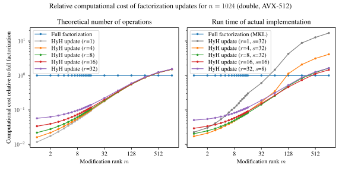
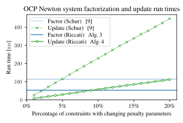
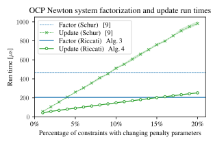
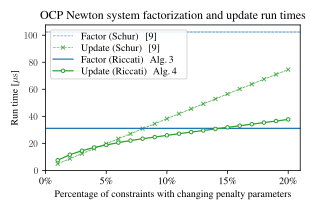

[](https://arxiv.org/abs/2503.15372v1)
[](https://github.com/kul-optec/hyhound/actions/workflows/linux.yml)
[](https://kul-optec.github.io/hyhound)
[](https://pypi.org/project/hyhound)

# hyhound

**Hy**perbolic **Ho**useholder transformations for **U**p- a**n**d **D**owndating Cholesky factorizations.

## Purpose

Given a Cholesky factor $L$ of a dense matrix $H$, the `hyhound::update_cholesky`
function computes the Cholesky factor $\tilde L$ of the matrix
$\tilde H = \tilde L \tilde L^\top = H + A \Sigma A^\top$ (where
$H,\tilde H\in\mathbb{R}^{n\times n}$ with $H \succ 0$ and $\tilde H \succ 0$,
$A \in \mathbb{R}^{n\times m}$, $\Sigma \in \mathbb{R}^{m\times m}$ diagonal,
and $L, \tilde L\in\mathbb{R}^{n\times n}$ lower triangular).

Computing $\tilde L$ in this way is done in $mn^2 + \mathcal{O}(n^2 + mn)$
operations rather than the $\frac16 n^3 + \frac12 mn^2 + \mathcal{O}(n^2 + mn)$
operations required for the explicit evaluation and factorization of $\tilde H$.
When $m \ll n$, this results in a considerable speedup over full factorization,
enabling efficient low-rank updates of Cholesky factorizations, for use in e.g.
iterative algorithms for numerical optimization.

Additionally, hyhound includes efficient routines for updating factorizations
of the Riccati recursion for optimal control problems.

## Preprint

The paper describing the algorithms in this repository can be found on arXiv: **<https://arxiv.org/abs/2503.15372v1>**

```bibtex
@misc{pas_blocked_2025,
	title = {Blocked {Cholesky} factorization updates of the {Riccati} recursion using hyperbolic {Householder} transformations},
	url = {http://arxiv.org/abs/2503.15372},
	doi = {10.48550/arXiv.2503.15372},
	publisher = {arXiv},
	author = {Pas, Pieter and Patrinos, Panagiotis},
	month = mar,
	year = {2025},
	note = {Accepted for publication in the Proceedings of CDC 2025}
}
```

## Installation

The Python interface is available on PyPI: https://pypi.org/project/hyhound

```sh
pip install hyhound
```

Currently, only Linux is supported (awaiting improved `std::simd` support in
MSVC and Clang).

## Usage

Documentation is available at **<https://kul-optec.github.io/hyhound>**.

See [python/test/test_update_cholesky.py](python/test/test_update_cholesky.py)
and [test_package/src/example.cpp](test_package/src/example.cpp) for usage examples.

## Building hyhound from source (Linux)

Requirements: [Conan](https://conan.io/) (2.19.1), [Intel MKL](https://www.intel.com/content/www/us/en/developer/tools/oneapi/onemkl-download.html).

If this is your first time using Conan, create a default profile for your system:
```sh
conan profile detect
```
Download the source code and recipes for building the dependencies:
```sh
git clone https://github.com/kul-optec/hyhound
cd hyhound
git clone https://github.com/tttapa/conan-recipes
conan remote add tttapa-conan-recipes "$PWD/conan-recipes"
```
Install the dependencies using Conan and build the project:
```sh
conan build . --build=missing -pr profiles/desktop \
    -s build_type=Release \
    -c tools.build:skip_test=True \
    -o guanaqo/\*:with_openmp=True \
    -o guanaqo/\*:with_mkl=True \
    -o \&:with_ocp=True \
    -o \&:with_benchmarks=True
```

The `desktop` profile enables AVX-512. If this is not supported by your hardware,
you can use the `laptop` profile, which uses AVX2 only (for Intel Skylake and
newer).

OpenBLAS can be used instead of the Intel MKL by passing the option
`-o guanaqo/\*:with_mkl=False` to Conan. Be sure to use CMake's
`--fresh` flag to reconfigure the project after making this change.

Only libstdc++ is currently supported (GCC 12-15 or Clang 18-20).

#### Reproducing the benchmark results

```sh
OMP_NUM_THREADS=1 ./build/benchmarks/Release/benchmark-hyh \
    --benchmark_out=hyh.json --benchmark_repetitions=5 --benchmark_min_time=0.02s \
    --benchmark_enable_random_interleaving --fix-n --n=64 --m=128
```
```sh
OMP_NUM_THREADS=1 ./build/benchmarks/Release/benchmark-ocp \
    --benchmark_out=ocp.json --benchmark_repetitions=5 --benchmark_min_time=1000x
```

## Benchmarks

Comparisons of the run time and performance between explicit evaluation and
factorization of the matrix $\tilde H = H + A\Sigma A^\top$ (_Full factorization_)
versus factorization updates using `hyhound::update_cholesky` (_HyH update_),
for different matrix sizes $n$ and varying update ranks $m$.
Versions with different block sizes $r$ are shown in different colors (with the
unblocked version in gray).

Experiments carried out on Intel Core i7-11700 at 2.5 GHz
(without dynamic frequency scaling), using version 2025.0 of the Intel MKL
for the full factorization (serial).

### Large matrices

| Double precision |
|:---:|
|  |

| Single precision |
|:---:|
|  |

| Double precision | Single precision |
|:---:|:---:|
|  |  |

### Medium-sized matrices

| Double precision |
|:---:|
|  |

| Single precision |
|:---:|
|  |

| Double precision | Single precision |
|:---:|:---:|
|  |  |

### Small matrices

| Double precision |
|:---:|
|  |

| Single precision |
|:---:|
|  |

| Double precision | Single precision |
|:---:|:---:|
|  |  |

## Optimal control benchmarks

Factorization and factorization updates of problems with optimal control
structure, as described in sections IV and V of the paper.

### Large problems

| $N=20,\quad n_x=240,\quad n_u=80,\quad n_c=240$ |
|:---:|
|  |

### Medium-sized problems

| $N=20,\quad n_x=24,\quad n_u=8,\quad n_c=24$ |
|:---:|
|  |

### Small problems

| $N=20,\quad n_x=6,\quad n_u=2,\quad n_c=6$ |
|:---:|
|  |
